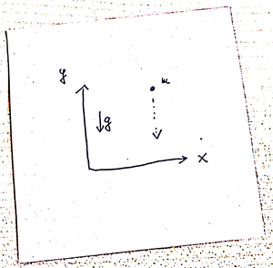
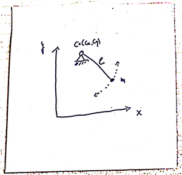
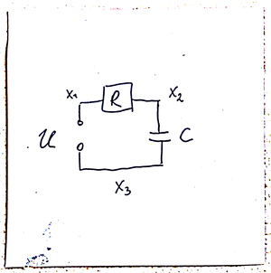

\newcommand{\ind}{\operatorname{ind}}

# Introduction

Differential-algebraic equations (DAEs) are coupled differential- and algebraic equations. DAEs often describe dynamical processes -- here are the *differential equations* -- that are subject to constraints: the *algebraic equations*.

<!--
```{block, type='JHSAYS'}
Throughout this lecture, the free variable will be the time $t$ and differentiation will always be considered with respect to $t$.
```
-->
```{block, type='JHSAYS'}
Let's start with a few examples.
```

## Examples

### Free fall vs. the pendulum {-}

```{r free-fall, echo=FALSE, fig.cap='Free fall of a point mass.', out.width='40%', fig.asp=.75, fig.align='center'}

```

Here, the laws of the free fall -- a special case of Newton's second law -- applies: 


```{block, type='JHSAYS'}
force equals mass times acceleration
```

In 2D, the $x$, $y$ coordinates of a point of mass $m$:

\begin{align*}
m\ddot x &= 0 \\
m\ddot y &= -mg
\end{align*}

where $g$ is the gravity; see Figure \@ref(fig:free-fall).

### The Pendulum {-}

```{block, type='JHSAYS'}
The same point mass attached to a string.
```

```{r pendulum, echo=FALSE, fig.cap='A pendulum.', out.width='40%', fig.asp=.75, fig.align='center'}

```

Again, we have `force = mass*acceleration` but also the conditions that the mass moves on a circle:

$$
 (x(t) - c_x)^2 + (y(t) - c_y)^2 = l^2,
$$
where $(c_x, c_y)$ are the coordinates of the center and $l$ is the length of the string; see Figure \@ref(fig:pendulum).

We use the Lagrangian function to derive the [*Euler-Lagrange equations*](https://en.wikipedia.org/wiki/Lagrangian_mechanics#Euler%E2%80%93Lagrange_equations_and_Hamilton's_principle) of motion. For the pendulum, we have the kinetic energy 
$$
  T = \frac 12 m (\dot x(t)^2 + \dot y(t)^2), 
$$
the potential 
$$
U = mgy,
$$ 
and the constraint 
$$
h = (x(t) - c_x)^2 + (y(t) - c_y)^2 - l^2 .
$$

Thus, with $$L:=U-T- \lambda h$$ and the requirement that 
$$
\frac{d}{dt}(\frac{\partial L}{\partial \dot q}) - \frac{\partial L}{\partial q} = 0
$$
for all of the *generalized coordinates* $q=x$, $y$, $\lambda$, 
one obtains a system of equations:

| Generalized coordinate | Equation |
|:-----------------------|---------:|
|$q \leftarrow x$ | $m\ddot x(t) + 2 \lambda(t) (x(t) - c_x) = 0$ |
|$q \leftarrow y$ | $m\ddot y(t) + mgy + 2 \lambda(t) (y(t) - c_y) = 0$ |
|$q \leftarrow \lambda$ | $(x(t) - c_x)^2 + (y(t) - c_y)^2 - l^2 =0$ |

```{example, name="The Pendulum", label="the-pendulum"}

After an order reduction via the new variables $u:=\dot x$ and $v=\dot y$ the overall system reads

\begin{equation}
\begin{split}
\dot x &= u \\
\dot y &= v \\
m \dot u &= - 2 \lambda (x - c_x) \\ 
m \dot v &= - 2 \lambda (y - c_y) - mgy \\
0&=(x - c_x)^2 + (y - c_y)^2 - l^2, 
\end{split}
(\#eq:pendulum)
\end{equation}

where we have omitted the time dependence. 
```

Equation \@ref(eq:pendulum) is a canonical example for a DAE with combined differential and algebraic equations.

### Electrical Circuits {-}

Another class of DAEs arises from the modelling electrical circuits. We consider the example of *charging a conductor through a resistor* as illustrated in Figure \@ref(fig:circuit).

<!--  -->

```{r circuit, echo=FALSE, fig.cap='Electrical circuit with a source, a resistor, and a conductor.', out.width='40%', fig.asp=.75, fig.align='center'}

```

We formulate the problem in terms of the potentials $x_1$, $x_2$, $x_3$, that are assumed to reside in the wires between a source $U$ and a resistor $R$, the resistor $R$ and the capacitor $C$, and the capacitor and the source.

A model for the circuit is given through the following principles and considerations.

| Model principle | Equation |
|:-----------------------|---------:|
| The source defines the difference in the neighboring potentials: | $x_1 - x_3 - U = 0$ |
| The current $I_R$ that is induced by the potentials neighboring the resistor is is defined through *Ohm's law*: | $I_R = \frac{x_1 - x_2}{R}$ |
| The current $I_C$ that is induced by the potentials neighboring the capacitor is described through: | $I_C = C(\dot x_3 - \dot x_2)$ |
| Everywhere in the circuit the currents sum up to zero. (This is *Kirchhoff's law*): | $I_C + I_R = C(\dot x_3 - \dot x_2)+ \frac{x_1 - x_2}{R}=0$ |
| To fix the potential, one can set a ground potential -- here we choose $x_3$. (note that so far all equations only consider differences in the potential). | $x_3 = 0$ |

```{example, label="the-circuit"}
Summing all up, the equations that model the circuit are given as 
\begin{equation}
\begin{split}
C(\dot x_3 - \dot x_2) &= - \frac{x_1 - x_2}{R} \\
0  &= x_1 - x_3 - U \\
0 &= x_3. 
\end{split}
(\#eq:circuit)
\end{equation}
```

### Navier-Stokes Equations {-}

The Navier-Stokes equations (NSE) are commonly used to model all kind of flows. They describe the evolution of the velocity $v$ of the fluid and the pressure $p$ in the fluid. Note that the flow occupies a spatial domain, say in $\mathbb R^{3}$ so that $v$ and $p$ are functions both of the time variable $t$ and a space variable $\xi$:

$$
v\colon (t, \xi) \mapsto v(t,\xi)\in \mathbb R^{3} \quad\text{and}\quad  p\colon (t, \xi) \mapsto p(t,\xi)\in \mathbb R.
$$

The NSE:

\begin{align*}
  \frac{\partial v}{\partial t} + (v\otimes \nabla_\xi)v - \Delta_\xi v + \nabla_\xi p &= 0, \\
  \nabla_\xi \cdot v &= 0,
\end{align*}

with $\otimes$ denoting the outer product and $\nabla_\xi$ and $\Delta_\xi$ denoting the gradient and the *Laplace* operator. If we only count the derivatives with respect to time, as postulated in the introduction, the NSE can be seen as an (abstract) DAE. 

```{block, type='JHSAYS'}
With *dynamical systems*, we focus on the evolution of time. That's why the time derivative is relevant for defining DAEs.
```

### Automatic Modelling or _Engineers vs. Mathematicians_ {-}

If a system, say an engine, consists of many interacting processes, it is convenient and common practice to model the dynamics of each particular process and to couple the subprocesses through interface conditions.

This coupling is done through equating quantities so that the overall model will consist of dynamical equations of the subprocesses and algebraic relations at the interfaces -- which makes it a DAE.

In fact, tools like [`modelica`](https://www.modelica.org/) for automatic modelling of complex processes do exactly this. 

```{block, type='JHSAYS'}
The approach of *automatic modelling* is universal and convenient for engineers. However, the resulting model equations will be DAEs which, as we will see, pose particular problems in their analytical and numerical treatment.  
```

## Why are DAEs difficult to treat

Firstly, DAEs do not have the smoothing properties of ODEs, where the solution is one degree smoother than the right hand side. Secondly, the algebraic constraints are essential for the validity of the model. Thus, a numerical approximation may render the model infeasible.

### Non-smooth Solutions {-}

```{example, label="nonsmooth-sols"}
Consider the equation

\begin{align*}
    \dot x_1(t) &= x_2(t) \\
        0 & = x_2(t) -g(t)
\end{align*}

where $g$ can be a nonsmooth function like

$$
    g(t) = 
    \begin{cases} 
        0, \quad\text{if}\quad t < 1 \\
        1, \quad\text{if}\quad t \geq 1 \\
    \end{cases}
$$

In this case the solution part $x_1=const. + \int_0^tg(s)ds$ will be a smooth function and the solution part $x_2=g$ will have jumps.
```

```{block, type='JHSAYS'}
Even worse, the solution of a DAE may depend on derivatives of the right hand sides.
```

This observation indicates that certain difficulties will arise since

 * numerical approximation schemes require smoothness of the solutions
 * differentiation is numerically ill-posed unlike numerical integration

### Numerical Solution Means Approximation {-}

Imagine the equations \@ref(eq:pendulum) that describe the pendulum are solved approximately. Then, the algebraic constraint will be violated, i.e. the point mass will leave the circle and the obtained numerical solution becomes infeasible.

Thus, special care has to be taken of the algebraic constraints when the equations of motions are numerically integrated.

